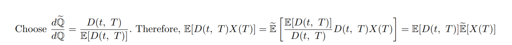

# math

by Derek Huang

_last updated on: 03-15-2020_  
_file created on: 10-13-2019_

The math repo contains some of the better bits of mathematical work that I have done on my own for fun.

Any errors are wholly my own. This repository is a work in progress, but will most likely see few updates, as most topics are not substantial enough to do a full article on. Article topics will most likely fall within the categories of financial math or statistical learning.