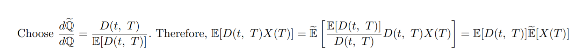

.. README.rst for my "math" repo

math
====

Some mathematical work that I have done on my own for fun.

   Note:

   Still deciding on a new banner.

See the `Building PDFs from TeX source`_ section for how to compile the ``.tex``
source in ``tex`` into PDF and see the `Building the C++ source`_ section for
how to build the accompanying C++ source code using `CMake`_.

Any mathematical errors are wholly my own.

.. _CMake: https://cmake.org/

Contents
--------

``examples``
~~~~~~~~~~~~
Contains C++ source and ``CMakeLists.txt`` for building CLI executables. These
typically will compute some numerical result or demonstrate an implementation
as instructed in an exercise or other application.

``include``
~~~~~~~~~~~
Contains C++ headers and ``CMakeLists.txt`` for library code used by the CLI
executables in ``examples``. There is no ``src`` directory since all the code
currently written is either templated or implemented as ``inline``.

``test``
~~~~~~~~
Contains C++ source and ``CMakeLists.txt`` for unit tests written with
GoogleTest_. If tests have been built, they can be run with ``run_tests.sh``,
which is a thin convenience script around CTest_.

.. _GoogleTest: https://google.github.io/googletest/

.. _CTest: https://cmake.org/cmake/help/latest/manual/ctest.1.html

``tex``
~~~~~~~

Contains the ``.tex`` source for my independent mathematical work. The
``exercises`` directory is for worked exercises from textbooks, monographs,
etc., while the ``original`` directory is for my own original work. The
``utils`` directory is for LaTeX setup or command definitions, which may be
used in other ``.tex`` files, typically by using ``\input``.

Building the C++ source
-----------------------

TBA. This project depends on Boost_ 1.71 and Eigen_ 3.4 headers and is intended
to be built using CMake_ 3.16 or newer using a C++17-compliant compiler. Local
builds on WSL 1 Ubuntu 20.04.3 LTS used GCC_ 9.3.0 while Windows 10 builds used
the VS 2022 x64 MSVC. Optionally, if one has GoogleTest_ installed, the unit
tests can be built and run.

.. _Boost: https://www.boost.org/

.. _Eigen: https://eigen.tuxfamily.org/

.. _GCC: https://gcc.gnu.org/

For POSIX systems, use the included ``build.sh`` build script. To build a
release build, use:

.. code:: bash

   ./build.sh -c Release

You can use the ``-Ca`` option to pass additional arguments to the CMake
configuration step, e.g. hints for `find_package`_ like
``-DGTest_ROOT=/path/to/googletest``, and so on.

.. _find_package: https://cmake.org/cmake/help/latest/command/find_package.html

Building PDFs from TeX source
-----------------------------

   Note:

   Using ``build_tex.sh`` is deprecated in favor of the CMake integration which
   enables near-optimal minimal rebuild while correctly determining how many
   times pdfLaTeX and BibTeX each need to be invoked. ``build_tex.sh`` is a
   dumb script that simply loops through subdirectories and is also messy,
   leaving behind ``.aux`` and other intemediate TeX/BibTeX output everywhere.
   The CMake integration cleanly generates the PDFs in the CMake build tree and
   as a convenience will copy the generated PDF back to the source tree.

You may compile the ``.tex`` source to PDF files using the provided
``build_tex.sh`` shell script if you have the ``bash`` shell [#]_ and
``pdflatex``. After using ``git clone`` to clone the repository contents, ``cd``
into the top-level repository directory, use ``chmod`` to set permissions
appropriately, for example with ``chmod 777 build_tex.sh``, and execute

.. code:: bash

   ./build_tex.sh

``build_tex.sh`` will then compile all ``.tex`` files in ``tex`` and write its
output to the ``pdf`` directory, which will mirror the directory tree of
``tex``. The ``pdf`` directory and its subdirectories will be created as needed.
If you do not wish to adjust permissions, use ``bash build_tex.sh`` instead of
executing with ``./``.

You can view help on more advanced use of ``build_tex.sh`` with
``build_tex.sh -h`` or ``build_tex.sh --help``.

.. [#] The ``bash`` shell is necessary since the improved ``[[`` is used once
   in ``build_tex.sh``.
